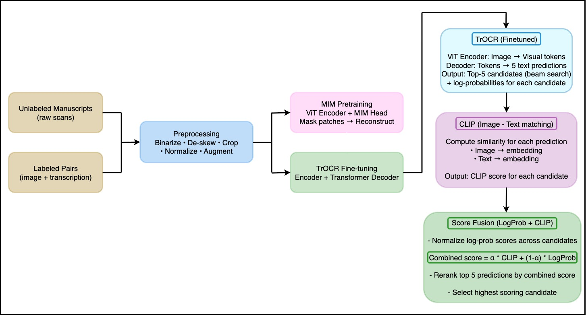
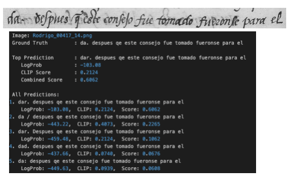
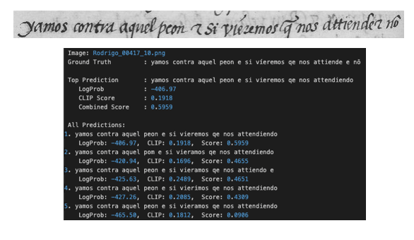
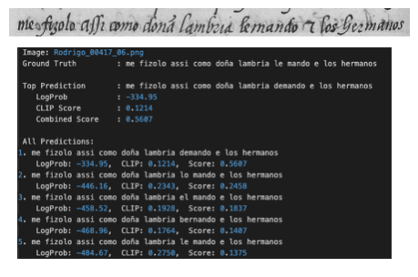
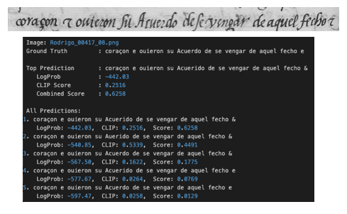
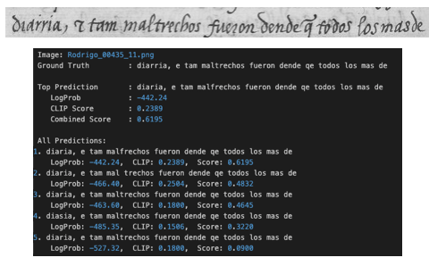
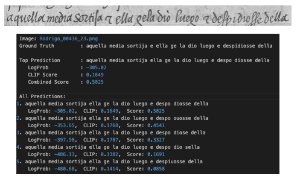

# RenAIssance : End-to-End Handwritten Texts Recognition

This repository contains an end-to-end pipeline for **Handwritten Text Recognition (HTR)** focused on early modern Spanish manuscripts. The project combines self-supervised visual pretraining, fine-tuned optical recognition, multimodal reranking, and score fusion to improve transcription accuracy on degraded, nonstandard historical handwriting.  

[Read the full article on Medium](https://medium.com/@aniketjunghare999/renaissance-deciphering-early-modern-handwritten-texts-with-artificial-intelligence-314804d9be0c)

---

# Dataset & Preparation

The project uses high-resolution manuscript scans from Spanish archives (15th–18th centuries), covering legal records, royal decrees, and literary texts. The dataset strategy blends **unlabeled images** (for MIM pretraining) with **line-level labeled pairs** (image + transcription) for supervised fine-tuning and evaluation.  

---

## Stage 1: Preprocessing Historical Manuscripts

Preprocessing standardizes and cleans scans to make handwriting features more learnable while preserving historical detail. Typical steps:

- **Binarization** : enhance ink/background contrast  
- **De-skewing** : correct page tilt so lines run horizontally  
- **Cropping** : remove margins and archival stamps; focus on lines  
- **Normalization** : resize to fixed model input (e.g., 384×384)  
- **Augmentation** : simulate historical aging (smudges, fading, tears) to improve robustness  

---

## Stage 2: Self-Supervised Pretraining : Masked Image Modeling (MIM)

A Vision Transformer (ViT) encoder is pretrained using MIM to learn robust visual representations from unlabeled manuscript pages:

- Split image into patches (e.g., 16×16)  
- Randomly mask ~50% of patches, train a lightweight decoder to reconstruct them  
- Loss: Mean Squared Error (MSE) between predicted and true pixels of masked patches  

MIM helps the encoder capture **ink textures, ligatures, and page artifacts** without requiring extensive manual transcriptions.  

---

## Stage 3: Fine-tuning TrOCR for Handwritten Text Recognition

TrOCR (vision encoder + transformer decoder) is fine-tuned on preprocessed image–transcription pairs:

- **Encoder**: ViT (pretrained with MIM)  
- **Decoder**: Transformer decoder producing Spanish text tokens  
- **Objective**: Cross-entropy loss (ignoring padding tokens), checkpointing by Character Error Rate (CER)  

During inference, **beam search** generates multiple hypotheses (e.g., top-5 candidates) instead of a single greedy output.  

---

## Stage 4: CLIP Reranking : Cross-modal Reasoning

CLIP embeds both images and text into a shared semantic space. For each TrOCR beam candidate:

1. Compute cosine similarity between manuscript image embedding and text embedding  
2. Rerank candidates so visually coherent transcriptions are prioritized  

This acts as a **visual “second opinion”** when TrOCR’s fluency alone leads to incorrect readings.  

---

## Stage 5: Score Fusion : Balancing Model Confidence and Visual Alignment

To combine multiple signals, TrOCR’s confidence (log-probabilities) and CLIP similarity are fused:

- Normalize log-probabilities across candidates  
- Final score = weighted combination (α tuned on validation, e.g., α ≈ 0.6)  

This balances **language model confidence** with **visual-semantic alignment**, improving robustness to handwriting variability.  

---

# Evaluation

- **Primary metrics**: Character Error Rate (CER) and Word Error Rate (WER), computed against line-level ground truth  
- **Ablation studies**: effect of MIM pretraining, beam width, CLIP fusion weights, and augmentation strategies  

---

This pipeline demonstrates how **modern AI techniques can unlock early modern Spanish archives**, enabling large-scale access for historians, linguists, and digital humanities researchers.  


---
## Project Structure

```

.
├── data_preparation.ipynb       
├── results.ipynb        # final output after reranking
├── Dataset/            (download from the provided drive link)            
├── Working_dataset/
├── output/  # csv file output before reranking               
└── src
    ├── train_mim_trocr.py
    ├── evaluate.py
    ├── reranking.py
├── model/    # trained mim_trocr model (download from the provided drive link)
├── environment.yml   # to create the environment                   


````
---

##  **Architecture**



---

##  **Results**









---


## 🔗 **Download Finetuned Model and Dataset**

- [**Trained Model** (`- download`)](https://drive.google.com/file/d/14zaKe415iDK1hiD_buqf_FqsAmNHFZj0/view?usp=sharing) (After extracting should be kept in 'model' folder)
- [**Dataset** (`- download`)](https://drive.google.com/file/d/1e5dDeLqlyrrbrDk3vjAGBpPKaDDSvwdg/view?usp=sharing) (After extracting should be kept in 'Dataset' folder)


---
## Implementation Guide**

### **1. Create environment**

```bash
conda env create -f environment.yml
```

###2. Run the Main Script:

After downloading dataset and finetuned model :
```bash
dataset_preparation.ipynb 
```
   
Execute the main script:
```bash
python train_mim_trocr.py 
```

```bash
python evaluate.py 
```

```bash
python clip_reranking.py 
```
  

---
